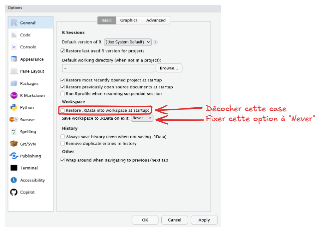
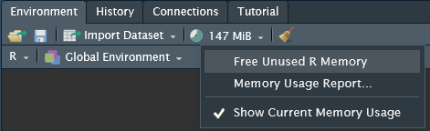
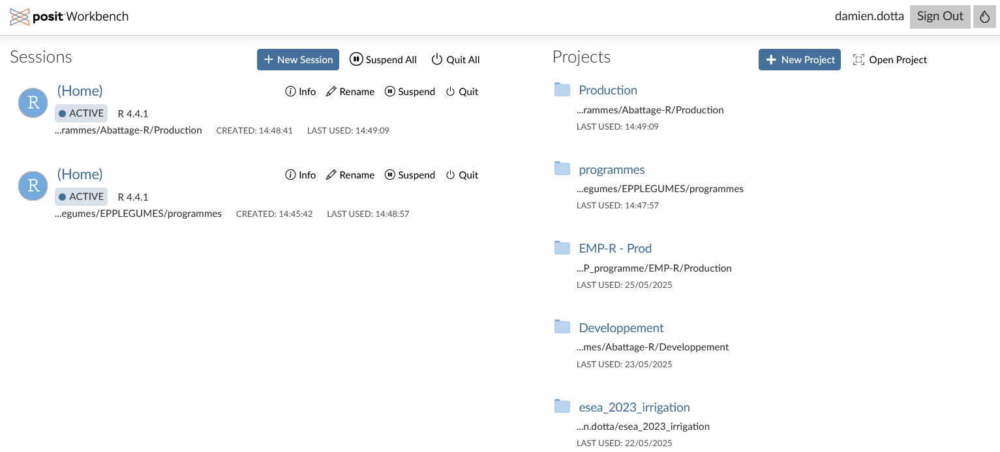
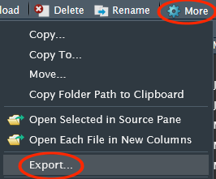

# Bonnes pratiques {.backgroundTitre}

## Cerise, un espace partagé

Comme tout espace partagé et mutualisé, il convient d'être économe en ressources sur Cerise.  

Le DéMéSIS a principalement 2 métriques en tête :  

- **La consommation de mémoire vive (RAM)** : utile pour stocker les données en cours de traitement dans les sessions R.  
- **La consommation de CPU (processeur)** : reflète l'intensité des calculs demandés par une session R.

## Gestion des ressources par les utilisateurs (1/2)

Voici quelques conseils pour limiter la consommation de mémoire sous Cerise :  

- **Désactiver la sauvegarde automatique des éléments de session**  

{fig-align="center"}

## Gestion des ressources par les utilisateurs (2/2)

- **Nettoyer régulièrement sa mémoire vive**  

Utiliser la fonction `gc()` pour libérer la mémoire occupée inutilement par votre session.  
Ou via l'interface de RStudio :  

{fig-align="center"}

Voir [cette page d'utilitr](https://book.utilitr.org/01_R_Insee/Fiche_utiliser_ressources.html) pour en savoir plus.
    
- **Pour les données volumineuses, privilégier le format de fichier Parquet**  (voir plus loin)
  Voir [ici](https://ssm-agriculture.github.io/formation-R-perf-06-parquet/) pour en savoir plus et/ou vous inscrire aux annonces de formation du BQIS.

## Gestion des sessions (1/2)

- Quand vous vous connectez sur Cerise via l'adresse fournie - **si vous n'avez qu'une session d'ouverte** - Cerise vous place directement dedans (vous arrivez donc dans l'interface RStudio).

- **À partir de 2 sessions ouvertes**, lorsque vous vous connectez à Cerise, vous allez arriver sur l'écran de gestion des sessions :  

{fig-align="center"}

## Gestion des sessions (2/2)

- Dans la colonne de gauche de l'écran des sessions, vous trouverez vos sessions ouvertes.  
- Dans la colonne de droite de l'écran des sessions, vous trouvez les différents projets que vous avez récemment utilisés.  

**Chaque session est indépendante des autres.** Si vous avez lancé un long traitement dans une session, celle-ci est occupée et non-réactive le temps du traitement, mais vous pouvez continuer à travailler normalement dans les autres sessions.

::: callout-important
## À retenir ! 

Il est important de veiller à limiter votre nombre de sessions actives (maximum 5 !) au risque de ne plus pouvoir accéder à Cerise par la suite.  

Au S2 2025, il est prévu de limiter le nombre de sessions en parallèle par utilisateur et de supprimer automatiquement les sessions inactives.
:::

## Chargement/Téléchargement de fichiers Cerise (1/2)

- Pour **charger** vers Cerise des fichiers depuis votre poste en local :  
    - Sur votre PC en local, faire un zip qui contient les fichiers à uploader (même si le fichier est unique). Cela permet d'affecter les "[bons droits](#rendre-un-dossier-ou-un-fichier-modifiable-par-vos-collègues)" sur ces fichiers (notamment qu'ils soient modifiables par d'autres agents).  
    - Cliquer sur le bouton "upload/télécharger" dans l'onglet "Files/Fichiers"  

{fig-align="center"}
  
La limite d'upload d'un fichier d'un poste local vers CERISE est de 10Go.  

- Pour **télécharger** depuis Cerise vers votre poste en local :  
  - Cocher le·s fichier·s
  - Cliquer sur la roue crantée dans l'onglet "Files"

{fig-align="center"}

## Chargement/Téléchargement de fichiers Cerise (2/2)

- Si vous souhaitez **charger** plusieurs fichiers en même temps vers Cerise, faire un fichier compressé ZIP.  
Son contenu sera ensuite automatiquement dézippé sous Cerise.  

::: callout-caution
## Pour information 

Les administrateurs de Cerise n'ont pas la possibilité de mettre en place un filtre sur le type de fichiers qui sont chargés sur Cerise => veillez à ne pas télécharger n'importe quel type de fichier (exécutables par exemple).
:::

   

- Si vous souhaitez **télécharger** en même temps plusieurs fichiers depuis Cerise, RStudio Server va automatiquement les joindre dans un fichier ZIP que vous récupérerez sur votre poste, en local.  

## Restauration des fichiers

- Offre de sauvegarde du centre de service (CDS)  
    - Sauvegarde complète le vendredi soir  
    - Sauvegarde différentielle les autres jours (Lun./Mar./Mer./Jeu. soir)  
    
- Les sauvegardes différentielles ne sont conservées que **15 jours calendaires**  

- Des demandes de restauration délicates voire impossibles :  
    - Délais de remontée du besoin métier  
    - Délais de prise en charge du centre de service
    
## Versionner votre code

Une bonne pratique pour limiter les demandes de restauration de fichiers est de **versionner avec Git** vos scripts et programmes R.  

**Git permet :**  

- D'obtenir de la traçabilité  
- De travailler collectivement  
- De faire des revues de code  
- De revenir en arrière dans le temps...  

Un module de formation est disponible [à cette adresse](https://ssm-agriculture.github.io/formation-git/), n'hésitez pas à vous y inscrire !  

Pour ceux d'entre vous déjà formés et qui souhaitent configurer Cerise avec Gitlab, suivre [ce tutoriel](https://github.com/user-attachments/files/19664705/Tutoriel.-.Configuration.d.une.connexion.Cerise_Gitlab.pdf).

## Utilisation du mode projet

Il est recommandé d'utiliser **le mode projet** le plus souvent possible.  
Plusieurs avantages :   

- Organisation claire  
- Gestion des chemins d'accès portable  
- Reproductibilité  
- Isolation des environnements (avec {renv})  
- Intégration avec Git ...

## Comparatif des formats de fichier de données

| Format | Taille du fichier | Utilisation mémoire | Vitesse écriture | Vitesse lecture |
|--------|-------------------|---------------------|------------------|-----------------|
| RDS | ✅ Moyenne à faible (compressé, un seul objet) | ⚠️ Modérée (lecture directe d'un objet) | ✅ Rapide (compresse par défaut) | ✅ Rapide (pour un seul objet) |
| CSV | ❌ Très grande (non compressé, texte brut) | ❌ Élevée (tout doit être parsé, conversion de type) | ✅ Rapide à écrire, peu coûteux | 🐢 Lent, très coûteux en ressources |
| Parquet | ✅ Faible (colonnes compressées, binaire) | ✅ Faible (lecture par lot, colonnes ciblées) | ⚠️ Écriture plus lente (compression + formatage) | 🚀 Très rapide |

## Résumé des propriétés des différents formats

- RDS  
   Format natif optimisé pour un seul objet R.  
   Très bon compromis pour la persistance simple et performante en R pur.  
- CSV  
    Très facile à manipuler manuellement, mais inefficace pour les gros volumes.  
    Pas de support natif pour les types de données (dates, facteurs).  
    Import/Export très lents en R pour de grands volumes.  
- Parquet  
    Requiert le package {arrow} en R.  
    Lecture partielle possible (par colonne ou ligne).  
    Excellent pour la mutualisation, le cloud, ou les flux inter-langages.  

## Recommandations selon le contexte

| Cas d'usage | Format conseillé |
|-------------|------------------|
| Persistance R native, mono-objet | RDS |
| Échange simple, manuel, petit volume | CSV |
| Volume important, usage mutualisé, scalable | Parquet |

## Mise à disposition d'applications Shiny

Pour certains cas métiers spécifiques et sous certaines contraintes (sécurité/performance/maintenabilité...), il est possible de déployer sur internet des applications web (R/Shiny) sur [shinyapps.io](https://shinyapps.io/).  

Des précautions s'imposent et doivent être prises en compte en amont des développements par les bureaux métiers et/ou les SRISE (pré-étude de sécurité obligatoire).  

Nous invitons les équipes concernés de se rapprocher du BQIS pour plus d'informations.

## Gestion des chemins

- Il est possible d'accéder **à la racine de Cerise** avec (au choix) :  
    - Le lien symbolique `~/CERISE`  
    - Le lien symbolique `/root_cerise/`  
    - Le chemin physique `var/data/nfs/CERISE/` (moins portable) 
    - L'instruction `fs::path_home("CERISE")`  
    
- Construire les chemins avec `here::here()` ou `fs::path_home()` par exemple
    
## Recommandations générales

- Éviter les `rm(list = ls())`  
- Privilégier l'écosystème **Tidyverse** avec ses packages et l'utlisation du `|>`  
- Utiliser le [guide de style du Tidyverse](https://style.tidyverse.org/) pour favoriser la lisibilité/cohérence/maintenabilité de votre code R. En particulier, pensez à :  
    - Indenter le code  
    - Aérer le code  
    - Utiliser la convention snake_case (`date_naissance`)  ...